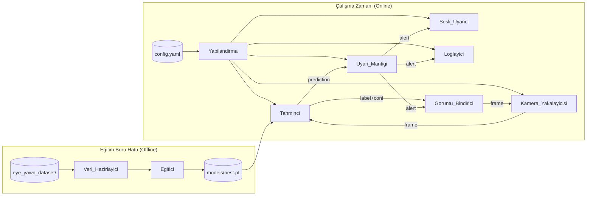
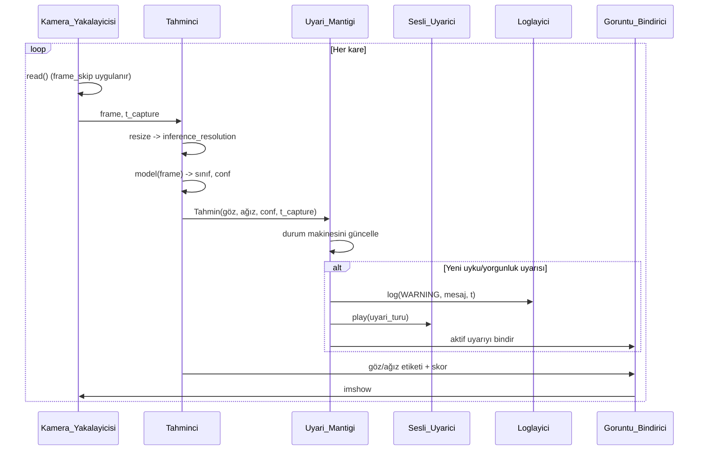
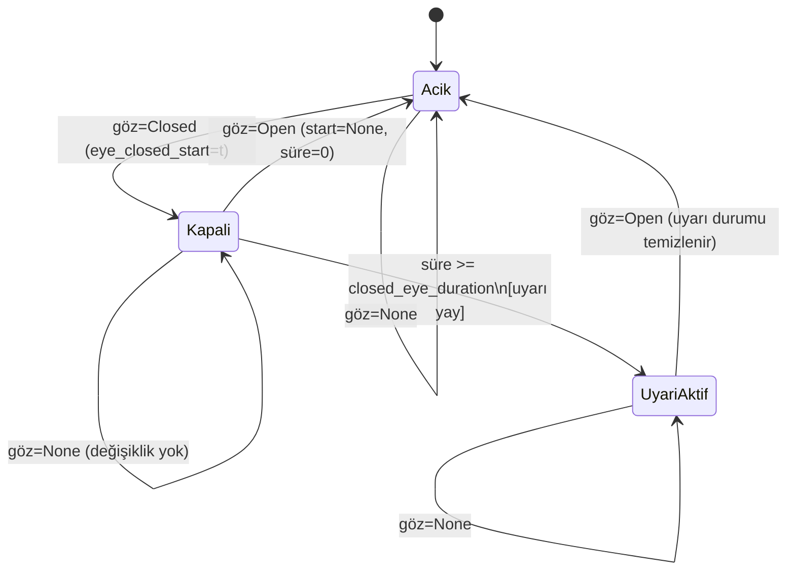
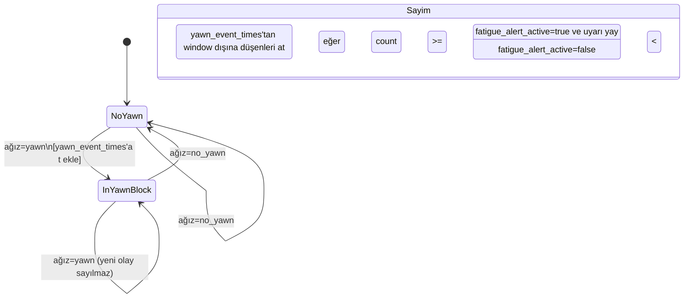
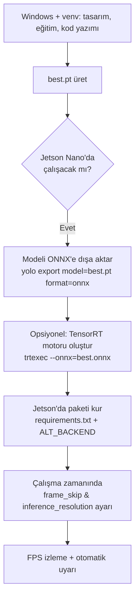
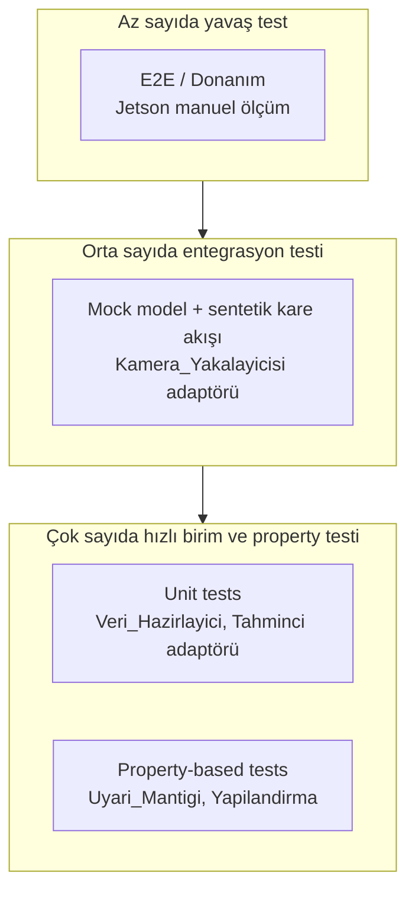

# Design Document

## Overview

Bu doküman, "Sürücünün Uyku ve Yorgunluk Durumu Tespiti" sisteminin
tasarımını tanımlar. Sistem, YOLOv8 (Ultralytics) **classification**
modeli ile sürücünün gözlerinin (`Closed`/`Open`) ve ağzının
(`yawn`/`no_yawn`) durumunu tek bir görüntü ya da canlı kamera akışı
üzerinden sınıflandırır; tahminleri zaman ekseninde takip ederek
`closed_eye_duration` eşiğini aşan uyku ve `yawn_time_window` içinde
`yawn_count` eşiğini aşan yorgunluk uyarılarını üretir.

Tasarımın temel ilkeleri:

1. **Sadelik ve modülerlik**: Bitirme projesi seviyesinde sunum ve
   değerlendirme yapılabilirliği için bileşenler küçük, sorumlulukları
   net Python modülleri olarak tasarlanır.
2. **Saf çekirdek (pure core), kirli kabuk (dirty shell)**: Uyari
   mantığı ve yapılandırma doğrulaması saf, deterministik fonksiyonlar
   olarak modellenir; kamera, model yükleme ve ses çalma gibi yan etki
   içeren işlemler kabuk katmanına itilir. Bu ayırım, P1-P7
   özelliklerinin property-based test ile doğrulanmasını mümkün kılar.
3. **Klasör tabanlı veri seti**: Mevcut `eye_yawn_dataset/` yapısı
   YOLOv8 sınıflandırma modu ile doğrudan kullanılır; yeniden
   etiketleme veya detection (bounding-box) dönüşümü yapılmaz.
4. **Tek yapılandırma kaynağı**: `config.yaml` (varsayılan) veya
   merkezi bir Python modülü, sistemin tüm eşiklerini tek noktadan
   yönetir; komut satırı argümanları yapılandırma değerlerini ezebilir.
5. **PC'den Jetson Nano'ya taşınabilirlik**: Aynı kod tabanı önce
   Windows + venv üzerinde çalıştırılır, ardından `frame_skip`,
   `inference_resolution` ve opsiyonel ONNX/TensorRT dışa aktarma
   parametreleri ile Jetson Nano üzerinde çalışır hale getirilir.

Tasarım, Requirement 1-11'in tamamını adresler ve P1-P7 özelliklerinin
test edilebilir hale gelmesini sağlayan bileşen sınırlarını çizer.

## Architecture

### Yüksek Seviyeli Bileşen Diyagramı



Eğitim boru hattı offline çalışır ve `models/best.pt` ağırlık
dosyasını üretir. Çalışma zamanı boru hattı bu ağırlığı yükler ve
canlı tahmin/uyarı akışını yürütür. İki boru hattı arasındaki tek
sözleşme `models/best.pt` dosyası ve veri seti sınıf isimleridir.

### Çalışma Zamanı Akışı



### Katmanlama

Sistem üç mantıksal katmandan oluşur:

| Katman | Bileşenler | Yan Etki | PBT Uygunluğu |
|--------|------------|----------|---------------|
| Çekirdek (saf) | Uyari_Mantigi, Yapilandirma doğrulayıcı, frame_skip planlayıcı | Yok | Yüksek (P1-P7) |
| Adaptör | Tahminci, Veri_Hazirlayici | Model yükleme, dosya I/O | Düşük (örnek tabanlı) |
| Kabuk | Kamera_Yakalayicisi, Sesli_Uyarici, Loglayici, UI bindirici | Donanım, dosya, ekran | Yok (smoke/entegrasyon) |

Bu ayırım, P1-P7'nin Çekirdek katmanına yoğunlaşmasını ve test
sırasında kamera/model bağımlılığı olmadan saniyeler içinde 100+
iterasyon koşturulabilmesini sağlar.

## Components and Interfaces

Aşağıdaki arayüzler Python tip ipuçları ile özetlenmiştir; gerçek
imzalar `src/` altındaki modüllerde implementasyon sırasında bu
sözleşmeye uygun şekilde yazılır.

### Veri_Hazirlayici (`src/data_prep.py`)

Sorumluluk: `eye_yawn_dataset/` yapısını doğrulamak ve YOLOv8
sınıflandırma modunun beklediği `data.yaml` ile birlikte deterministik
bir kök dizin üretmek.

```python
EXPECTED_CLASSES: tuple[str, ...] = ("Closed", "Open", "no_yawn", "yawn")
ALLOWED_EXTENSIONS: tuple[str, ...] = (".jpg", ".jpeg", ".png")

def prepare_dataset(source_root: Path, output_root: Path) -> DatasetReport:
    """
    eye_yawn_dataset kök yolunu doğrular, train/test alt dizinlerini
    tarar, geçerli görüntüleri sayar ve data.yaml'i üretir.
    Hata durumunda DatasetError yükseltir (sıfırdan farklı çıkış kodu).
    """

@dataclass
class DatasetReport:
    root: Path
    class_names: tuple[str, ...]    # ("Closed", "Open", "no_yawn", "yawn")
    class_indices: dict[str, int]   # {"Closed": 0, "Open": 1, ...}
    counts_train: dict[str, int]
    counts_test: dict[str, int]
    total_train: int
    total_test: int
    grand_total: int
```

Adresler: Requirement 1.1-1.7.

### Egitici (`src/train.py`)

Sorumluluk: Ultralytics YOLOv8 sınıflandırma API'sini sarmalamak,
parametreleri doğrulamak ve `models/best.pt` ağırlığını üretmek.

```python
@dataclass
class TrainConfig:
    model_size: Literal["yolov8n", "yolov8s", "yolov8m", "yolov8l", "yolov8x"] = "yolov8n"
    epochs: int = 50          # 1..500
    imgsz: int = 640          # 320..1280, 32 katı
    batch: int = 16           # 1..128
    data_root: Path = Path("dataset")
    output_dir: Path = Path("models")

def validate_train_config(cfg: TrainConfig) -> None:
    """Aralık ve değer kümesi dışı parametrelerde ConfigError yükseltir."""

def run_training(cfg: TrainConfig, cli_overrides: dict) -> TrainReport:
    """
    CLI argümanları yapılandırma değerlerini ezer, eğitim sonunda
    en iyi ağırlığı models/best.pt olarak kopyalar.
    """
```

Adresler: Requirement 2.1-2.8.

### Tahminci (`src/predictor.py`)

Sorumluluk: `models/best.pt` ağırlığını yüklemek, tek bir görüntü ya
da kare üzerinde sınıflandırma yapmak ve dört sınıf için güven
skorlarını döndürmek. Statik tahmin (Requirement 3) ve canlı
tespitin tahmin adımı (Requirement 4.3) bu bileşeni paylaşır.

```python
@dataclass(frozen=True)
class Prediction:
    eye: Literal["Open", "Closed"] | None        # None = düşük güven
    mouth: Literal["yawn", "no_yawn"] | None     # None = düşük güven
    eye_conf: float            # 0.0..1.0
    mouth_conf: float          # 0.0..1.0
    raw_scores: dict[str, float]  # tüm 4 sınıf
    t_capture_s: float         # monotonik saniye

class Predictor:
    def __init__(self, model_path: Path, inference_resolution: int | None,
                 confidence_threshold: float): ...
    def predict_image(self, image_path: Path) -> Prediction: ...
    def predict_frame(self, frame: np.ndarray, t_capture_s: float) -> Prediction: ...
```

Tek bir görüntüde dört sınıf da skorlanır; göz ve ağız ayrı
"binary" kararlara `argmax({Closed,Open})` ve
`argmax({yawn,no_yawn})` ile indirgenir. `confidence_threshold`
altındaki tahminler `None` olarak işaretlenir, böylece P6 ve
Requirement 5.7/6.7 doğal olarak adreslenir.

Adresler: Requirement 3.1-3.5, 4.3, 10.8.

### Kamera_Yakalayicisi (`src/webcam_detect.py`)

Sorumluluk: OpenCV (`cv2.VideoCapture`) üzerinden kamera kaynağını
açmak, kareleri okumak, `frame_skip` uygulamak, `q` tuşuyla temiz
kapanışı yönetmek ve FPS ölçümü için zaman damgalarını sağlamak.

```python
@dataclass
class CameraConfig:
    source: int | str          # 0..9 ya da yol/RTSP
    open_timeout_s: float = 5.0
    consecutive_read_fail_limit: int = 30
    no_frame_timeout_s: float = 3.0
    frame_skip: int = 1        # 1..10

class CameraCapture:
    def open(self) -> None: ...
    def frames(self) -> Iterator[CapturedFrame]:
        """frame_skip dikkate alınarak yalnızca tahmine giden
        kareler yield edilir; aradaki kareler gösterim için
        ayrı kuyrukta tutulabilir."""
    def close(self) -> None: ...

@dataclass(frozen=True)
class CapturedFrame:
    image: np.ndarray
    t_capture_s: float         # monotonik
    frame_index: int
```

`frame_skip` yalnızca **tahmine giden** kareleri seyreltir;
gösterim akışı kesilmez (Requirement 10.6). `q` tuşu olayı
`cv2.waitKey` döngüsünden okunur ve 1 saniye içinde temiz çıkışı
tetikler (Requirement 4.7).

Adresler: Requirement 4.1-4.7, 10.2, 10.6, 10.7.

### Uyari_Mantigi (`src/alert_logic.py`)

Sorumluluk: Sistemin saf çekirdeği. Tahmin akışı üzerinde iki
bağımsız durum makinesi (uyku, yorgunluk) yürütür, uyarıları üretir
ve P1-P7 özelliklerinin doğrulandığı yer burasıdır.

Aşağıdaki tasarım `AlertEngine` sınıfını ve değişmez bir durum
nesnesini kullanır; engine'in `update` metodu **saf**'tır: zaman ve
yapılandırma dışarıdan enjekte edilir, dönüş değeri yeni durum ve
üretilen uyarı listesidir.

```python
@dataclass(frozen=True)
class AlertConfig:
    closed_eye_duration_s: float    # 0.5..10.0
    yawn_count: int                 # 1..20
    yawn_time_window_s: float       # 10.0..600.0
    confidence_threshold: float     # 0.0..1.0

@dataclass(frozen=True)
class AlertState:
    eye_closed_start_s: float | None
    eyes_currently_closed: bool
    drowsy_alert_active: bool
    last_eye_was_closed: bool
    yawn_event_times_s: tuple[float, ...]   # son window içindekiler
    in_yawn_block: bool
    fatigue_alert_active: bool

@dataclass(frozen=True)
class AlertEvent:
    kind: Literal["DROWSY", "FATIGUE"]
    message: str
    t_event_s: float

INITIAL_STATE = AlertState(
    eye_closed_start_s=None,
    eyes_currently_closed=False,
    drowsy_alert_active=False,
    last_eye_was_closed=False,
    yawn_event_times_s=(),
    in_yawn_block=False,
    fatigue_alert_active=False,
)

def update(state: AlertState, pred: Prediction, cfg: AlertConfig
          ) -> tuple[AlertState, list[AlertEvent]]:
    """
    Saf fonksiyon. Tek bir tahmini işler, yeni state ve sıfır veya
    daha fazla uyarı olayını döndürür. Düşük güvenli (None) tahminler
    göz/ağız akışlarını ayrı ayrı atlatır (Req 5.7, 6.7, P6).
    """
```

`update` saf olduğundan, property tabanlı testler `Prediction`
listeleri üreterek deterministik olarak çalıştırılabilir. Bileşen
sadece `time.monotonic()`'i bir saat fonksiyonu enjeksiyonu olarak
alır; testlerde sahte saat (fake clock) verilebilir.

Adresler: Requirement 5.1-5.7, 6.1-6.7, P1-P7.

### Sesli_Uyarici (`src/sound_alert.py`)

Sorumluluk: Yeni `AlertEvent` üretildiğinde opsiyonel olarak ses
çalmak. Platforma göre arka uç seçer ve aynı uyarı türü için eş
zamanlı yeniden tetiklemeyi engeller.

```python
@dataclass
class SoundConfig:
    enable_sound: bool = False
    sound_file: Path = Path("assets/alert.wav")
    max_duration_s: float = 3.0

class SoundAlerter:
    def __init__(self, cfg: SoundConfig, logger: Logger): ...
    def play(self, kind: Literal["DROWSY", "FATIGUE"]) -> None:
        """500 ms içinde çalmaya başlar. Aynı kind için ses
        oynamaktayken yeni istek yok sayılır (Req 7.7).
        Hata durumunda log'a yazar, akışı kesmez (Req 7.6)."""
```

Platforma göre arka uç:

- Windows: `winsound.PlaySound(..., SND_ASYNC)` (yerleşik, ek paket
  gerektirmez)
- Linux/Jetson: `playsound` (cross-platform); başarısız olursa
  `aplay` alt-süreç çağrısına düşer.

Adresler: Requirement 7.1-7.7.

### Yapilandirma (`src/config.py` + `config.yaml`)

Sorumluluk: Tek bir yerden tüm parametreleri okumak, doğrulamak ve
diğer bileşenlere değişmez (immutable) bir nesne olarak vermek.
`config.py` saf bir doğrulayıcı barındırır; YAML okuma kabuğa aittir.

```python
@dataclass(frozen=True)
class AppConfig:
    # Uyarı mantığı
    closed_eye_duration: float
    yawn_count: int
    yawn_time_window: float
    confidence_threshold: float

    # Kamera ve performans
    camera_index: int
    frame_skip: int
    inference_resolution: int | None
    fps_log_interval: float

    # Model ve dağıtım
    model_path: Path
    export_format: Literal["pt", "onnx", "tensorrt"]

    # Ses ve loglama
    enable_sound: bool
    log_file: Path
    log_max_bytes: int
    verbose: bool

DEFAULTS: dict[str, Any] = {
    "closed_eye_duration": 2.0,
    "yawn_count": 3,
    "yawn_time_window": 60.0,
    "confidence_threshold": 0.5,
    "camera_index": 0,
    "frame_skip": 1,
    "inference_resolution": None,
    "fps_log_interval": 1.0,
    "model_path": "models/best.pt",
    "export_format": "pt",
    "enable_sound": False,
    "log_file": "logs/app.log",
    "log_max_bytes": 10 * 1024 * 1024,
    "verbose": False,
}

def validate(raw: dict) -> AppConfig:
    """
    Eksik anahtarları DEFAULTS ile doldurur (uyarı seviyesinde
    log'lar). Aralık dışı veya tip hatalı değerlerde ConfigError
    yükseltir. model_path'in mevcut olduğunu doğrular.
    """

def load_config(path: Path = Path("config.yaml")) -> AppConfig:
    """YAML okur ve validate() çağırır."""
```

`validate` saf bir fonksiyon olarak tasarlanır, böylece P5
(yapılandırma değerleri davranışı belirler) ve Requirement 8.1-8.6
property tabanlı test ile doğrulanabilir.

Adresler: Requirement 8.1-8.6, 10.4, 10.7, 10.8.

### Loglayici (`src/logger.py`)

Sorumluluk: ISO 8601 zaman damgalı, seviye etiketli mesajları hem
terminale hem de döner (rotating) bir log dosyasına yazmak; FPS
raporlama ve performans uyarılarını üretmek.

Standart kütüphanedeki `logging` modülü ile `RotatingFileHandler`
kullanılır:

```python
def build_logger(cfg: AppConfig) -> Logger:
    """
    StreamHandler (stdout) + RotatingFileHandler (cfg.log_file,
    maxBytes=cfg.log_max_bytes, backupCount=5).
    Format: '%(asctime)s [%(levelname)s] %(message)s'
    asctime formatı '%Y-%m-%d %H:%M:%S' olarak sabitlenir.
    """

class FpsTracker:
    def tick(self, t_now_s: float) -> None: ...
    def average_fps(self, window_s: float = 1.0) -> float: ...
    def maybe_log(self, t_now_s: float, interval_s: float) -> None: ...
```

Log dosyası yazımı başarısız olursa `logging` Handler hata politikası
ile terminale uyarı verilir ve döngü kesilmez (Requirement 9.6).

Adresler: Requirement 9.1-9.7, 10.9, 10.10.

### Goruntu_Bindirici (Kamera_Yakalayicisi içinde)

Sorumluluk: Kare üzerine `Goz_Durumu`, `Agiz_Durumu` ve aktif
uyarıları, kare yüksekliğinin en az %3'ü büyüklüğünde, kontrastlı
renkle ve toplamda kare alanının %25'inden az yer kaplayacak şekilde
yazmak. OpenCV `cv2.putText` + arkaplan dikdörtgeni kullanılır.

Adresler: Requirement 4.4.

## Data Models

### Veri Seti Sözleşmesi

Disk üzerindeki yapı (giriş):

```
eye_yawn_dataset/
├── train/
│   ├── Closed/   *.jpg|*.jpeg|*.png
│   ├── Open/
│   ├── no_yawn/
│   └── yawn/
└── test/
    ├── Closed/
    ├── Open/
    ├── no_yawn/
    └── yawn/
```

`Veri_Hazirlayici` çıkışı (YOLOv8 classification kök dizini):

```
dataset/
├── train/<sınıf>/...
├── test/<sınıf>/...   (val olarak kullanılır)
└── data.yaml
```

`data.yaml` şeması:

```yaml
path: <abs_path_to_dataset_root>
train: train
val: test
names:
  0: Closed
  1: Open
  2: no_yawn
  3: yawn
```

Sınıf indeksleri sözlük sırasıyla deterministik olarak atanır.

### Yapılandırma Şeması (`config.yaml`)

```yaml
# Uyarı mantığı
closed_eye_duration: 2.0     # 0.5..10.0 saniye
yawn_count: 3                # 1..20
yawn_time_window: 60.0       # 10.0..600.0 saniye
confidence_threshold: 0.5    # 0.0..1.0

# Kamera ve performans
camera_index: 0              # 0..10
frame_skip: 1                # 0..30 (canlı tespitte etkin aralık 1..10)
inference_resolution: null   # null | 160..1280, 32 katı
fps_log_interval: 1.0        # 1..60 saniye

# Model ve dağıtım
model_path: "models/best.pt"  # <= 512 karakter
export_format: "pt"           # pt | onnx | tensorrt

# Ses
enable_sound: false
sound_file: "assets/alert.wav"

# Loglama
log_file: "logs/app.log"
log_max_bytes: 10485760       # 1..100 MB
verbose: false
```

### Tahmin ve Uyarı Veri Modeli

`Prediction` ve `AlertEvent` veri sınıfları yukarıda
"Components and Interfaces" bölümünde tanımlanmıştır. Önemli
değişmezler:

- `Prediction.eye_conf` ve `mouth_conf` alanları kapalı aralık
  `[0.0, 1.0]` içinde olmalıdır; aksi halde Tahminci üst sınıfta
  doğrulama hatası yükseltir.
- `Prediction.t_capture_s` monotonik (geri sarılmayan) bir saatten
  alınmalıdır; çünkü Uyari_Mantigi süre çıkarımları yapar
  (Requirement 5.1, 5.2).
- `AlertEvent.t_event_s` her zaman tetikleyen `Prediction`'ın
  `t_capture_s` değerine eşit veya ondan büyüktür.

### Durum Makinesi (Uyari_Mantigi)

İki bağımsız durum makinesi tek bir `AlertState` içinde tutulur.

#### Uyku (göz) durum makinesi



Notlar:

- `Closed` -> `Open` -> `Closed` dizisi başlangıç zamanını sıfırlar
  (P2).
- `UyariAktif` durumundan tek çıkış yolu en az bir `Open` karesidir
  (Requirement 5.6).
- `göz=None` (düşük güven) hiçbir geçişi tetiklemez (P6, Req 5.7).

#### Yorgunluk (ağız) durum makinesi



`Sayim` her karede çalışır, hem `NoYawn` hem `InYawnBlock`
durumlarında geçerlidir. `ağız=None` hiçbir durumu değiştirmez
(Req 6.7).

### Frame-Skip Modeli

`frame_skip = n` için tahmine giden kare indeksleri
`{0, n, 2n, ...}` olur; gösterim ve kapanış olay döngüsü her karede
çalışır. Bu, Uyari_Mantigi'nin gördüğü zaman ekseninin gerçek zaman
ekseninin alt örneklenmiş hali olduğu anlamına gelir; uyarı zamanı
en fazla `n / FPS` saniye geç tetiklenebilir (P7).


## Correctness Properties

*Bir özellik (property), bir sistemin tüm geçerli yürütmelerinde
geçerli olması gereken bir karakteristik veya davranıştır; sistemin
ne yapması gerektiği hakkında resmi bir ifadedir. Özellikler, insan
tarafından okunabilir spesifikasyonlar ile makine tarafından
doğrulanabilir doğruluk garantileri arasında köprü kurar.*

Aşağıdaki özellikler, prework analizi sonucunda Uyari_Mantigi ve
Yapilandirma'nın saf çekirdeğine yoğunlaştırılmıştır. Bu yoğunlaşma
sayesinde her özellik, kamera ve model bağımlılığı olmadan
sentetik tahmin akışları üzerinde 100+ iterasyon ile
deterministik olarak çalıştırılabilir.

Tasarım property'leri ile requirements.md'deki P1-P7 arasındaki
eşleme:

| Tasarım Property | Karşılık gelen Requirement P-numarası |
|------------------|---------------------------------------|
| Property 1       | P1                                    |
| Property 2       | P2                                    |
| Property 3       | P3                                    |
| Property 4       | P4                                    |
| Property 5       | P5                                    |
| Property 6       | P6                                    |
| Property 7       | P7                                    |
| Property 8       | (yapılandırma doğrulayıcı; Req 5.5, 6.5, 8.1, 8.5, 9.4, 10.7) |
| Property 9       | (varsayılana düşme; Req 8.4)          |


### Property 1: Uyku uyarısı yalnızca eşik aşıldığında üretilir

*Her* `Prediction` dizisi (göz değerleri `Open`, `Closed` ya da
`None`) ve her geçerli `closed_eye_duration` eşiği için,
`Uyari_Mantigi.update` çağrılarının ürettiği `DROWSY` uyarılarının
sayısı, dizide süresi `closed_eye_duration`'a eşit veya bundan
büyük olan kesintisiz `Closed` bloklarının sayısına tam olarak
eşittir.

**Validates: Requirements 5.3, 5.6**

### Property 2: Açılan göz sayacı sıfırlar

*Her* `Prediction` dizisi için, herhangi bir konumda göz `Open`
olarak gözlemlenirse, ondan sonraki ilk `Closed` karesinde
hesaplanan `Kapali_Goz_Suresi` o karenin `t_capture_s` değerinden
sıfır farkıyla başlar (yeni `eye_closed_start_s` o kareye eşittir).

**Validates: Requirements 5.1, 5.2, 5.4**

### Property 3: Esneme zaman penceresi metamorfik özelliği

*Her* esneme olay zaman dizisi `T = (t_1, ..., t_k)` ve her geçerli
`yawn_count`, `yawn_time_window` çifti için:

1. Aynı diziyi sabit `Δt` ile öteleyerek üretilen
   `T' = (t_1+Δt, ..., t_k+Δt)` dizisinde üretilen `FATIGUE` uyarı
   sayısı `T` üzerindeki sayı ile aynıdır.
2. `yawn_time_window` değeri büyütüldüğünde uyarı sayısı azalmaz;
   küçültüldüğünde artmaz (monotonik).

**Validates: Requirements 6.2, 6.4**

### Property 4: Tek esneme tek olay sayılır

*Her* `Prediction` dizisi içindeki kesintisiz `yawn` bloğu için
(blok uzunluğu ne olursa olsun), `Uyari_Mantigi` o bloğa karşılık
yalnızca bir adet `yawn_event` zaman damgası kaydeder; bloğun
ortasındaki ekstra `yawn` kareleri yeni olay üretmez. Ancak `no_yawn`
karesinin ardından yeniden `yawn` görülürse yeni bir olay sayılır.

**Validates: Requirements 6.1, 6.6**

### Property 5: Yapılandırma eşikleri davranışı monoton belirler

*Her* `Prediction` dizisi için ve her `c1 <= c2` çift
`closed_eye_duration` değeri için, aynı dizi üzerinde
`closed_eye_duration = c1` ile üretilen `DROWSY` uyarı sayısı
`closed_eye_duration = c2` ile üretilen sayıdan küçük değildir.
Aynı kural `yawn_count` parametresi için `FATIGUE` uyarı sayısında
da geçerlidir.

**Validates: Requirements 5.5, 6.5**

### Property 6: Düşük güvenli kareler durumu değiştirmez

*Her* `Prediction` dizisi için, dizinin herhangi bir konumuna
güveni `confidence_threshold` altında olan (`eye=None` veya
`mouth=None`) ek `Prediction`'lar eklendiğinde, `Uyari_Mantigi`'nin
ürettiği uyarı dizisi (kind ve t_event_s'leri ile) ile son
`AlertState`, ek tahminler eklenmemiş haliyle aynıdır.

**Validates: Requirements 5.7, 6.7**

### Property 7: Frame-skip uyarı zamanlamasını yalnızca tek kare çözünürlüğünde geciktirir

*Her* `Prediction` dizisi `S` ve her `n ∈ {1,...,10}` için, `S`
üzerinde `frame_skip = 1` ile üretilen uyarı dizisi `A1` ile
`frame_skip = n` ile üretilen uyarı dizisi `An` arasında:

1. Her `kind ∈ {DROWSY, FATIGUE}` için sayı farkı en fazla 1'dir
   (`||A1[kind]| - |An[kind]|| ≤ 1`).
2. Eşleşen `i.` uyarılar arasındaki `t_event_s` farkı en fazla
   `n / FPS` saniyedir.

**Validates: Requirements 10.6**

### Property 8: Yapılandırma doğrulayıcı sınırları korur

*Her* parametre adı `k` ve değer `v` ikilisi için, `validate({k: v})`:

1. `v` o parametrenin belgelenmiş aralığı/değer kümesi içindeyse
   ve diğer tüm parametreler varsayılanlarda ise hata yükseltmeden
   geçerli bir `AppConfig` döner.
2. `v` aralığın dışındaysa veya beklenen tipte değilse `ConfigError`
   yükseltir; `AppConfig` döndürmez.

Aralıklar: `closed_eye_duration ∈ [0.5, 10.0]`,
`yawn_count ∈ {1,...,20}`, `yawn_time_window ∈ [10.0, 600.0]`,
`confidence_threshold ∈ [0.0, 1.0]`,
`camera_index ∈ {0,...,10}`, `frame_skip ∈ {0,...,30}`,
`fps_log_interval ∈ [1.0, 60.0]`,
`inference_resolution ∈ {160, 192, ..., 1280}` veya `null`,
`log_max_bytes ∈ [1 MB, 100 MB]`,
`export_format ∈ {pt, onnx, tensorrt}`.

**Validates: Requirements 5.5, 6.5, 8.1, 8.5, 9.4, 10.7**

### Property 9: Eksik parametreler varsayılana düşer ve uyarı log'u üretir

*Her* yapılandırma anahtar alt kümesi `K ⊂ keys(DEFAULTS)` için,
`validate({k: DEFAULTS[k] for k in K})` çağrısı:

1. Sonuç `AppConfig` nesnesinde `K`'da bulunmayan her `m` anahtarı
   için değer `DEFAULTS[m]`'e eşittir.
2. Eksik her `m` için `WARNING` seviyesinde, parametre adı ve
   uygulanan varsayılan değeri içeren tam bir log satırı üretilir.

**Validates: Requirements 8.4**

## Error Handling

Hata davranışları üç kategoriye ayrılır.

### Başlatma Zamanı Hataları (sistem başlamaz)

| Senaryo | Davranış | Çıkış Kodu | Adresler |
|---------|----------|------------|----------|
| Beklenen sınıf klasörü eksik | `DatasetError` mesajı + tam yol | 2 | Req 1.5 |
| Sınıf klasörü boş | `DatasetError` mesajı + sınıf adı | 2 | Req 1.6 |
| Eğitim parametresi aralık dışı | `ConfigError` + parametre adı, alınan, beklenen | 3 | Req 2.3 |
| `data.yaml` veya veri seti kökü yok | `DatasetError` + yol | 2 | Req 2.7 |
| `model_path` mevcut değil | `ConfigError` + tam yol | 4 | Req 3.5, 8.5 |
| Yapılandırma değeri geçersiz | `ConfigError` + parametre adı/değer/sebep | 5 | Req 8.5 |
| Yapılandırma kaynağı yok / parse edilemez | `ConfigError` + kaynak yolu, parse hatası | 5 | Req 8.6 |
| Kamera 5 sn içinde açılamıyor | Hata mesajı + tüm kaynakları serbest bırak | 6 | Req 4.5 |

`ConfigError` ve `DatasetError`, `Exception` üzerinden türeyen,
mesajda otomatik olarak bağlam (parametre adı, beklenen aralık)
taşıyan özel istisna sınıflarıdır. Hiçbir varsayılan değer
sessizce uygulanmaz; sadece **eksik** parametre durumunda
varsayılan kullanılır ve `WARNING` seviyesinde log'lanır
(Requirement 8.4).

### Çalışma Zamanı Hataları (akış kesintisiz devam eder)

| Senaryo | Davranış | Adresler |
|---------|----------|----------|
| Düşük güvenli kare (`conf < confidence_threshold`) | Tahmin `None` olarak iletilir, durum değişmez | Req 5.7, 6.7, P6 |
| Tek bir kare okunamadı | Sayaç artar; eşik altında devam | Req 4.6 |
| Ses çalma hatası | Hata log'lanır, akış kesilmez, sistem yaşamaya devam eder | Req 7.6 |
| Log dosyası yazılamadı | Terminal uyarısı; 30 sn'de bir retry; canlı tespit kesilmez | Req 9.6 |
| Log dosyası boyut sınırını aştı | Mevcut dosya `.1` olarak arşivlenir, yeni dosya açılır | Req 9.7 |
| ONNX/TensorRT dönüşümü başarısız | Hata log'lanır, `.pt` modeline geri dönülür | Req 10.5 |
| Jetson FPS 30 sn boyunca <5 | Performans uyarısı + parametre tavsiyeleri (`inference_resolution`, `frame_skip`) | Req 10.10 |

### Akışı Sonlandıran Çalışma Zamanı Hataları

| Senaryo | Davranış | Çıkış Kodu | Adresler |
|---------|----------|------------|----------|
| 30 ardışık başarısız okuma | Mesaj + kaynak temizleme | 7 | Req 4.6 |
| 3 sn boyunca yeni kare yok | Mesaj + kaynak temizleme | 7 | Req 4.6 |
| Kullanıcı `q` tuşuna bastı | 1 sn içinde temiz çıkış, kaynaklar serbest | 0 | Req 4.7 |

Tüm hata mesajları `Loglayici` üzerinden `ERROR` seviyesi ile, ISO
8601 zaman damgasıyla hem terminale hem rotating log dosyasına
yazılır.

## Jetson Nano Optimizasyon Stratejisi

### Geliştirme ve Dağıtım Akışı



### Optimizasyon Kademeleri

Performans hedefi `≥5 FPS` (Requirement 10.9) aşağıdaki kademelerle
elde edilir; her kademe yalnızca öncekinden yetersiz kalındığında
devreye girer:

1. **Model boyutu**: Jetson varsayılanı `yolov8n` (Req 10.3).
2. **Çıkarım çözünürlüğü**: `inference_resolution = 320` (32 katı,
   `[160, 1280]` aralığında) ile başla; gerekirse 256, 224, 192'ye
   düşür (Req 10.8).
3. **Frame-skip**: `frame_skip = 2` ile her ikinci karede çıkarım
   yap; gerekirse 3-5'e çıkar. Gösterim akışı her zaman tam
   FPS'te kalır (Req 10.6).
4. **Model formatı**: `export_format = onnx` ile başla; daha yüksek
   FPS için `tensorrt` kullan. Dönüşüm başarısız olursa otomatik
   olarak `.pt`'ye geri dönülür (Req 10.4, 10.5).
5. **Kamera formatı**: Mümkünse `cv2.CAP_GSTREAMER` ile CSI
   kameradan `nvarguscamerasrc` boru hattını kullan; USB kamerada
   `MJPG` codec'i tercih et.

### Otomatik Performans İzleme

`FpsTracker` 30 saniyelik kayan pencere üzerinden ortalama FPS
hesaplar. Ortalama 30 saniye boyunca 5 FPS'in altına düşerse
sistem `WARNING` seviyesinde performans uyarısı verir ve
parametre önerilerini terminale yazar (Req 10.9, 10.10):

```
2025-01-15 14:32:01 [WARNING] Performans düşük: son 30 sn ortalama
FPS=3.42 (hedef >=5). Öneri: inference_resolution=224 ve
frame_skip=2 deneyin.
```

## Testing Strategy

### Test Piramidi



### Kullanılacak Araçlar

- **pytest** ana test koşucusu.
- **Hypothesis** Python için olgun property-based testing
  kütüphanesi; `@given` ve özel stratejiler ile sentetik
  `Prediction` dizileri üretmek için kullanılır. Property tabanlı
  testleri sıfırdan yazmayız.
- **pytest-cov** kapsama raporu.
- **pyfakefs** dosya sistemi etkileşimlerinin saf birim testlerinde
  kullanılması için (Veri_Hazirlayici).

### Property-Based Test Yapılandırması

- Her property testi en az **100 iterasyon** koşar (`@settings(max_examples=100)`).
- Her property testi, doğruladığı tasarım property'sine etiket olarak
  başvurur:
  ```python
  # Feature: driver-drowsiness-detection,
  # Property 1: Uyku uyarısı yalnızca eşik aşıldığında üretilir
  @given(prediction_sequences(), closed_eye_durations())
  @settings(max_examples=100, deadline=None)
  def test_property_1_drowsy_alert_count(seq, threshold):
      ...
  ```
- Her tasarım property'si **tek bir** property tabanlı testle
  doğrulanır.

### Hypothesis Stratejileri

`tests/strategies.py` altında merkezi olarak tanımlanır:

| Strateji | Üretir | Kullanım |
|----------|--------|----------|
| `eye_label()` | `"Open" \| "Closed" \| None` | Tahmin dizileri |
| `mouth_label()` | `"yawn" \| "no_yawn" \| None` | Tahmin dizileri |
| `prediction_sequences()` | `Prediction` listeleri (monoton artan zaman) | P1, P2, P3, P4, P6, P7 |
| `closed_eye_durations()` | `[0.5, 10.0]` aralığında float | P1, P5, Property 8 |
| `yawn_thresholds()` | `(yawn_count, yawn_time_window)` çiftleri | P3, P5 |
| `frame_skip_values()` | `{1, ..., 10}` | P7 |
| `valid_config_values(param)` | Her parametre için aralık-içi değer | Property 8, 9 |
| `invalid_config_values(param)` | Her parametre için aralık-dışı değer | Property 8 |

### Test Kategorileri ve Adresledikleri Gereksinimler

| Kategori | Test Tipi | Adresledikleri |
|----------|-----------|----------------|
| Uyari_Mantigi çekirdeği | Property tests (Hypothesis) | P1-P7, Property 8, 9 |
| Yapılandırma doğrulayıcı | Property tests | Property 8, 9; Req 5.5, 6.5, 8.1, 8.4, 8.5, 9.4, 10.7 |
| Veri_Hazirlayici | Unit tests + property test (uzantı filtresi, sayım invariantı) | Req 1.1-1.7 |
| Tahminci (mock model) | Unit tests + property test (top-class = argmax, skor [0,1]) | Req 3.1, 3.2 |
| Tahminci (girdi doğrulama) | Unit tests | Req 3.4, 3.5 |
| Egitici sözleşmesi | Unit tests + integration (mock Ultralytics) | Req 2.1-2.8 |
| Kamera_Yakalayicisi (mock VideoCapture) | Unit tests + property (okuma sayım eşiği) | Req 4.1-4.7 |
| Sesli_Uyarici | Unit tests + property (eşzamanlı yok sayma) | Req 7.1-7.7 |
| Loglayici | Unit tests + property (FPS sayım, log satırı invariantı) | Req 9.1-9.7 |
| Jetson optimizasyonları | Unit tests (mock) + manuel donanım testi | Req 10.1-10.10 |
| Proje yapısı | Statik unit tests (dosya/dizin varlığı, başlık kontrolü) | Req 11.1-11.6 |

### Manuel ve Donanım Testleri

Aşağıdaki davranışlar otomatik PBT/CI ortamında test edilemez ve
manuel doğrulama gerektirir:

- Webcam açılış süresi `<5 sn` (Req 4.1).
- PC'de `≥15 FPS`, Jetson'da `≥5 FPS` (Req 4.1, 10.9).
- Kare yakalamadan tahmine `≤200 ms` gecikme (Req 4.3).
- Sesli uyarı `≤500 ms` içinde duyulur olur (Req 7.1).
- ONNX/TensorRT dönüşümünün gerçek modeller üzerinde başarılı olması
  (Req 10.4).

Bu maddeler için `docs/manual_test_checklist.md` altında bir kontrol
listesi tutulur ve sunum öncesinde bir kez yürütülür.

### Birim ve Property Test Dengesi

- Property testleri saf çekirdek (Uyari_Mantigi, Yapılandırma
  doğrulayıcı, FpsTracker karar mantığı) üzerine yoğunlaşır;
  generators ile yüzlerce edge-case otomatik kapsanır.
- Birim (örnek tabanlı) testler aşağıdakiler için tutulur:
  - Adaptör katmanı sözleşmeleri (model dosyası yükleme, mock
    Ultralytics çağrıları, OpenCV `VideoCapture` davranışı).
  - Hata yolları (geçersiz girdi, eksik dosya, izin reddi).
  - Statik proje yapısı kontrolü.
  - UI bindirme görsel doğrulaması (örnek görüntüler).

## İz Sürme Matrisi (Özet)

| Requirement | Bileşen(ler) | Test Tipi |
|-------------|--------------|-----------|
| Req 1 | Veri_Hazirlayici | Unit + 1 property (uzantı filtresi) |
| Req 2 | Egitici | Unit + 1 property (CLI override) + integration (mock) |
| Req 3 | Tahminci | Unit + 2 property (argmax, skor aralığı) |
| Req 4 | Kamera_Yakalayicisi, Goruntu_Bindirici | Unit + 1 property (okuma sayım, font ölçeği) + manuel |
| Req 5 | Uyari_Mantigi | Property (P1, P2 + Property 5, 6, 8) |
| Req 6 | Uyari_Mantigi | Property (P3, P4 + Property 5, 6, 8) |
| Req 7 | Sesli_Uyarici | Unit + 1 property (concurrency dedupe) + manuel |
| Req 8 | Yapilandirma | Property (Property 8, 9) + unit (kaynak hatası) |
| Req 9 | Loglayici, FpsTracker | Property (FPS, log satırı) + unit (rotation) |
| Req 10 | Predictor, Kamera_Yakalayicisi, FpsTracker | Property (P7, frame_skip indeks, perf uyarı) + manuel |
| Req 11 | Statik | Unit |
